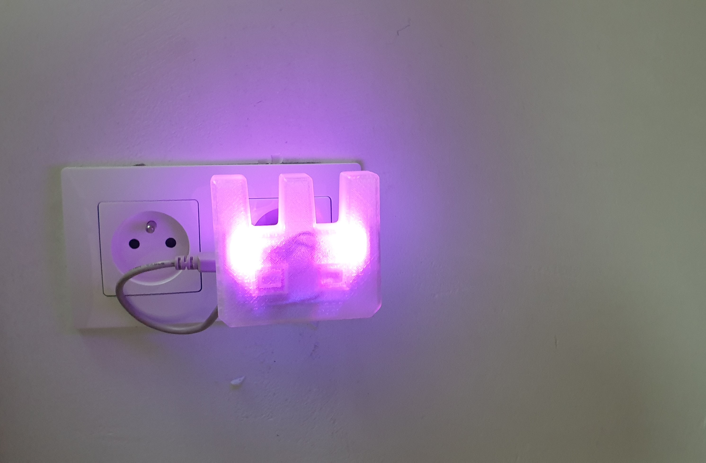
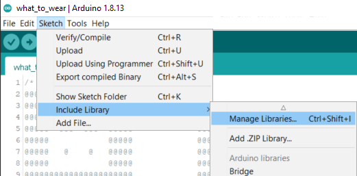
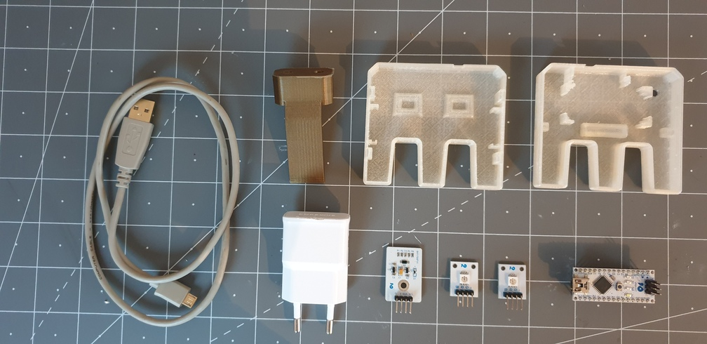
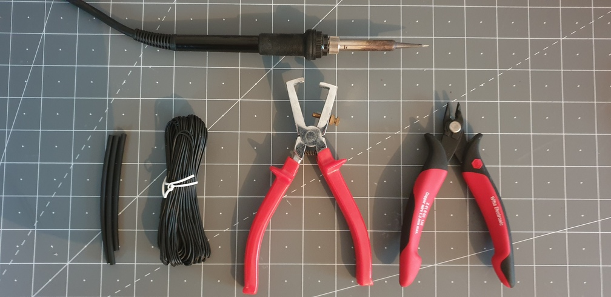

# Whaddy Nightlight



Make A Cool Nightlight in the shape of Whaddy! This wil fit on any phone charger in the EU

## Project description - How Does it work?

### What can this project do?
This project uses an Digital light sensor to measure the ambient light. When a certain light value is reached, the 2 SMD RGB leds will turn on and give your room a purple shine!
The enclosure is designed for 3D printing in the shape of our Mascot!
The 3D printed parts are available on our Thingiverse page: "3D print parts". These are designed with a Snap fit connection for the electronic modules and to close it. So you dont have to find screws. 
The nightlight is supported by a bracket (also  3D printed), which is designed for most EU mobile phone chargers.

### You will need to do the following things for the project to work:

### Level of difficulty: Intermediate

## MATERIALS

### Ingredients:
* Arduino Nano or equivalent (e.g. [Whadda Atmega328 Nano Development Board (WPB102)](https://whadda.com/product/atmega328-development-board-wpb102/))
* Light sensor (e.g. [BH1750 dgital light intensity sensor module (VMA341)](https://whadda.com/product/bh1750-digital-light-intensity-sensor-module-vma341/))
* RBG SMD LED modules (e.g. [ARDUINO® COMPATIBLE 3 COLOUR RGB SMD LED MODULE (2 Pcs)(VMA318)](https://whadda.com/product/arduino-compatible-3-colour-rgb-smd-led-module-2-pcs-vma318/))
* PLA naturel (e.g. [1.75 Mm (1/16″) PLA FILAMENT – NATURAL – 750 G](https://whadda.com/product/1-75-mm-1-16-pla-filament-natural-750-g-pla175n07/))
* Soft electrical wires
* Any USB A cable (old one is good enough but it hast to work)

### Tools:
* PC with [Arduino IDE](https://www.arduino.cc/en/Main/Software) installed
* Soldering iron
* Solder
* Stripping pliers
* Cutting pliers
* Shrink tubes
* Heat gun of hair dryer
* 3D printer

## 3D printing the NightLight:

There are no supports needed, Be sure to 3D print the Whaddy in a transparent filament. Otherwise, you won`t be able to see the LEDs inside. 
Also be sure to print it with 100% infill to get the best result.

## PROGRAMMING  the development board

### Dev board: Arduino Nano (compatible)

### Processor: ATMega328P

### Code language: Arduino

### Difficulty: Medium

### Preparations:
#### Installing Arduino Libraries




Use the Arduino library manager (```Sketch > Include Library > Manage Libraries...```) to install the following libraries:


* [hp_BH1750(by Starmbi)](https://github.com/Starmbi/hp_BH1750)

#### Checking the Arduino sketch

1) Open the ```Whaddy_Nighlight.ino``` Arduino Sketch
2) Select the ```Arduino Nano``` board form the boards menu by going to ```Tools > Board > Arduino AVR Boards > Arduino Nano```
3) Select the ```ATmega328P (Old Bootloader)``` board form the boards menu by going to ```Tools > Processor >  > ATmega328P (Old Bootloader)```
4) Check if the Arduino sketch compiles correctly by hitting the ```Verify``` button (checkmark button left of the upload button). If everything is installed correctly no errors should pop-up and the compilation process should finish with the final message ```Done compiling```. If this process fails, please check if you installed all necessary libraries and selected the correct board.

## Prepping the connections
### Connection Table light sensor
| BH1750 digital light intensity sensor | Arduino Nano |
|:-----------:|:---------------------:|
| G | GND |
| V | 5V |
| SDA | A4 |
| SCL | A5 |

### Connection Table SMD RGB leds 
|3 COLOUR RGB SMD LED MODULE | Arduino Nano |
|:-----------:|:---------------------:|
| - | GND |
| G | A2 |
| R | A1 |
| B | A0 |

## Running the code!

Almost done with the coding part. After this we can start installing the electronics in the 3D printed case.

### Setting the light value

As mentioned earlier, the RGB LEDs will turn on when it gets dark. The value corresponds to the ambient ligt that the senor is measuring (LUX). 
So 0 = DARK
300 = OFFICE LIGHT
100 000 = SUNLIGHT :) 
We`ve set the value that it turns on at twilight (10).
Changing the value van be done here:

```Cpp
// Value to determe at wich value the LEDs should switch on
// The lower the value,the darker 
int Dark = 10;
/////////////////////////////////////////
```

### Changing the color of the RGB LEDS 

You can change the color of the nightlight to whatever you want by changing the setColor value(R, G, B) format. We`ve set it in the Whadda purple. 

```Cpp
  if (Alux < Dark) {      // When Avarage Lux measurement is lower then....
    setColor(210, 0, 210); // Set color to Purple (RGB)
  }
  ```
### Uploading and checking the program
You're now ready to upload the code! Hit the upload button and wait until the program is compiled and uploaded. The nightlight should turn on when you cover the light sensor with your hand. If you're encountering any issue check the serial monitor to see if the board was able to give correct readings from the B1750 dgital light intensity sensor.

## Soldering and assembling the electronics
### Overview of the Ingredients & Tools




