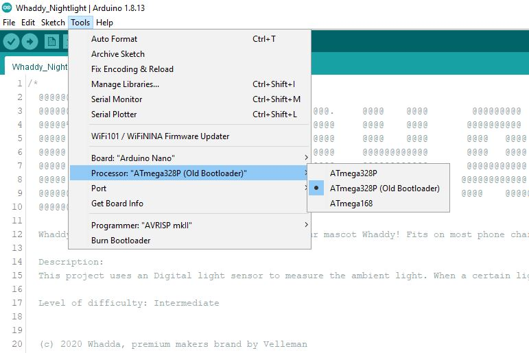

# Whaddy Nightlight


Make a cool nightlight in the shape of Whadda's very own mascot, Whaddy! This design will fit onto any phone charger in the EU.

## Project description - How Does it work?

### What can this project do?
This project uses a digital light sensor to measure the ambient light. When a certain light value is reached, the 2 SMD RGB LEDs will turn on and give your room or hallway a purple glow!
The enclosure is designed for 3D printing and has the shape of our mascot!
The parts are also designed to have a snap fit connection for the electronic modules and to close it. This way, you don't need any screws. 
The nightlight is supported by a bracket which you also need to 3D print, and is designed for most EU mobile phone chargers or small USB adaptors.

### Level of difficulty: intermediate

## MATERIALS

### Ingredients:
* Arduino Nano or equivalent like the [Whadda Atmega328 Nano Development Board (WPB102)](https://whadda.com/product/atmega328-development-board-wpb102/)
* [BH1750 dgital light intensity sensor module](https://whadda.com/product/bh1750-digital-light-intensity-sensor-module-vma341/)
* [Arduino® compatible 3 colour RGB SMD LED module (2 pcs)](https://whadda.com/product/arduino-compatible-3-colour-rgb-smd-led-module-2-pcs-vma318/)
* [1.75 mm (1/16″) PLA filament - natural – 750 G](https://whadda.com/product/1-75-mm-1-16-pla-filament-natural-750-g-pla175n07/)
* soft electrical wires
* any USB A cable (an old one is good enough but it has to work)
* standard EU phone charger/adaptor

### Tools:
* PC with [Arduino IDE](https://www.arduino.cc/en/Main/Software) installed
* soldering iron
* solder
* stripping pliers
* cutting pliers
* shrink tubes
* heat gun of hair dryer
* 3D printer

## 3D printing the NightLight:

The Nightlight consist out of 3 3D printed parts
* Nightlight Top  (Whaddy_Nightlight_TOP.stl)
* Nightlight Bottom (Whaddy_Nightlight_BOTTOM.stl)
* Nightlight Bracket (ChargeHolder.stl)

Find all the .stl files for the case of this project in the 3D design file.

There are no supports needed. Be sure to 3D print the Nightlight Top and Bottom in a transparent filament. Otherwise, you won`t be able to see the LEDs inside. 
Also, be sure to print it with 100% infill to get the best result.


## Progrqmming the development board

### Dev board: Arduino Nano (compatible)

### Processor: ATMega328P

### Code language: Arduino

### Difficulty: Medium

### Preparations:
#### Installing Arduino Libraries


Use the Arduino library manager (```Sketch > Include Library > Manage Libraries...```) to install the following libraries:


* [hp_BH1750(by Starmbi)](https://github.com/Starmbi/hp_BH1750)

#### Checking the Arduino sketch

1) Open the ```Whaddy_Nighlight.ino``` Arduino Sketch
2) Select the ```Arduino Nano``` board form the board's menu by going to ```Tools > Board > Arduino AVR Boards > Arduino Nano```

3) Select the ```ATmega328P (Old Bootloader)``` board form the board's menu by going to ```Tools > Processor >  > ATmega328P (Old Bootloader)```

4) Check if the Arduino sketch compiles correctly by hitting the ```Verify``` button (checkmark button left of the upload button). If everything is installed correctly, no errors should pop-up and the compilation process should finish with the final message ```Done compiling```. If this process fails, please check if you installed all necessary libraries and selected the correct board.

## Prepping the connections
### Connection table light sensor
| BH1750 digital light intensity sensor | Arduino Nano |
|:-----------:|:---------------------:|
| G | GND |
| V | 5V |
| SDA | A4 |
| SCL | A5 |

### Connection table SMD RGB LEDs 
|3 COLOUR RGB SMD LED MODULE | Arduino Nano |
|:-----------:|:---------------------:|
| - | GND |
| G | A2 |
| R | A1 |
| B | A0 |

## Running the code!

Almost done with the coding part. After this we can start installing the electronics in the 3D printed case.

### Setting the light value

As mentioned earlier, the RGB LEDs will turn on when it gets dark. The value corresponds to the ambient ligt that the senor is measuring (LUX). 
So 0 = DARK
300 = OFFICE LIGHT
100 000 = SUNLIGHT :) 
We`ve set the value so that it turns on at twilight (10).
Changing the value can be done here:

```Cpp
// Value to determe at wich value the LEDs should switch on
// The lower the value, the darker 
int Dark = 10;
/////////////////////////////////////////
```

### Changing the color of the RGB LEDs 

You can change the color of the nightlight to whatever you want by changing the setColor value(R, G, B) format. We`ve set it to Whadda purple. 

```Cpp
  if (Alux < Dark) {      // When Avarage Lux measurement is lower then....
    setColor(210, 0, 210); // Set color to Purple (RGB)
  }
  ```
### Uploading and checking the program
You are now ready to upload the code! Hit the upload button and wait until the program is compiled and uploaded. The nightlight should turn on when you cover the light sensor with your hand. If you're encountering any issue, check the serial monitor to see if the board was able to give correct readings from the B1750 dgital light intensity sensor.

## Soldering and assembling the electronics
#### Overview of the ingredients


#### Overview of the Tools


#### Step 1: Cut off or desolder the ICSP pins from the Arduino Nano. We do this to save some space in the 3D printed case.
CUT OFF


DESOLDER


#### Step 2: Place the Arduino Nano into the provided place at the bottom of the case from the Nightlight, as shown in the picture below.


#### Step 3: Solder 4 wires to the pins of the BH1750 digital light intensity sensor.


#### Finish off the connections by putting heatshrinks around them.


#### Step 4: Place the BH1750 digital light intensity sensor in the provided place at the bottom of the case from the Nightlight.


#### Step 5: Measure the aprox length of the cables from the light sensor to the Arduino Nano pins (See connection diagram), and cut them off. 


#### Step 6: Remove the Arduino and light sensor from the case. Solder the wires according the connection diagram. Don't forget to put heatshrinks onto the connections!!  DON'T SOLDER THE 5V YET, WE WILL DO THIS LATER ON.


#### Step 7: Solder wires to the pins of the SMD RGB LEDs modules. Don't forget to finsh the connections off with heatshrinks!


#### Step 8: The Leds will be mounted in the TOP part of the nightlight. insert them in the provided place and. Then bring the wires from the 2 LED modules together (color by color) and cut them off as shown in the picture below (not too short, otherwise the assembly will be difficult). Again, do not forget the heatshrinks :).


#### Step 9: Start soldering the 2 SMD RGB led modules to the Arduino Nano according the connection diagram. DON'T SOLDER THE GND YET, WE WILL DO THIS LATER ON.


#### The assembly should look something like this by now:


#### Step 10: Cut off the USB A cable (approx. 25cm) and strip it (approx. 7.5cm).


#### Step 11: Cut away the excess shielding and wires until you only have the + and - wires.


#### Then strip and solder the ends of these wires.


#### Step 12: Feed the + and - wires trough the hole of the bottom part form the Nightlight.


#### Step 13: Solder the + wire from the USB cable and the 5V wire from the light sensor the the 5V pin of the Arduino Nano.


#### Step 14: Solder the - from the USB cable and the - wires from RGB SMD LED modules to the GND pin of the Arduino Nano.


#### Step 15: Slide the 2 LED modules into the provided place of TOP part from the Nightlight.


#### Step 16: Now close the Nightlight TOP and BOTTOM half. The design uses a snap fit, so no need for screws!


#### Step 17: The next step is to mount the bracket on the charger, as shown in the picture below.


#### Step 18: Click the bracket into the slot of the BOTTOM part of the Nightlight. BE CAREFULL, DO NOTT BREAK THE BRACKET (it is a fairly tight fitting).


#### Step 19: WOOHOOO, Last step. Plug the USB A into the Charger. 


